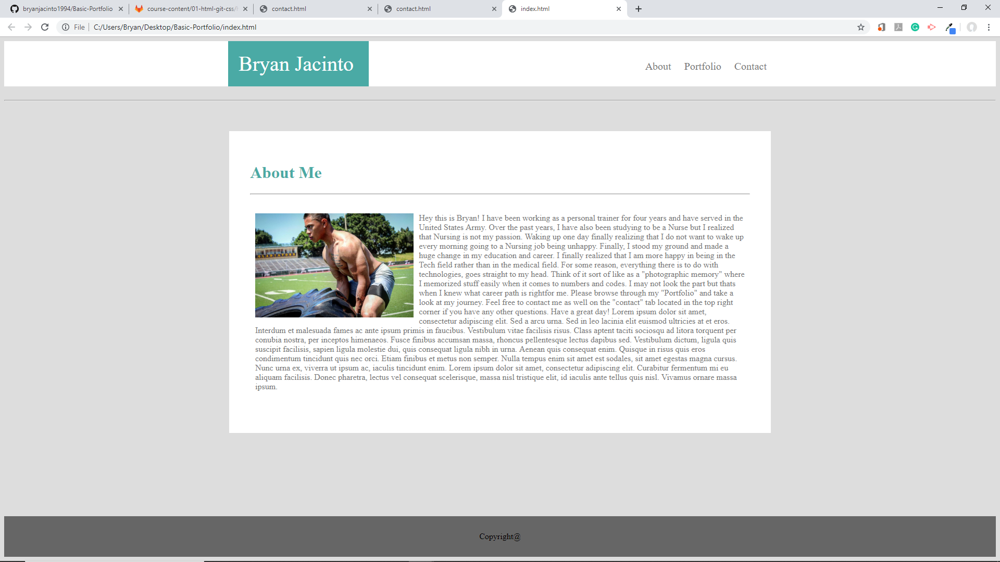
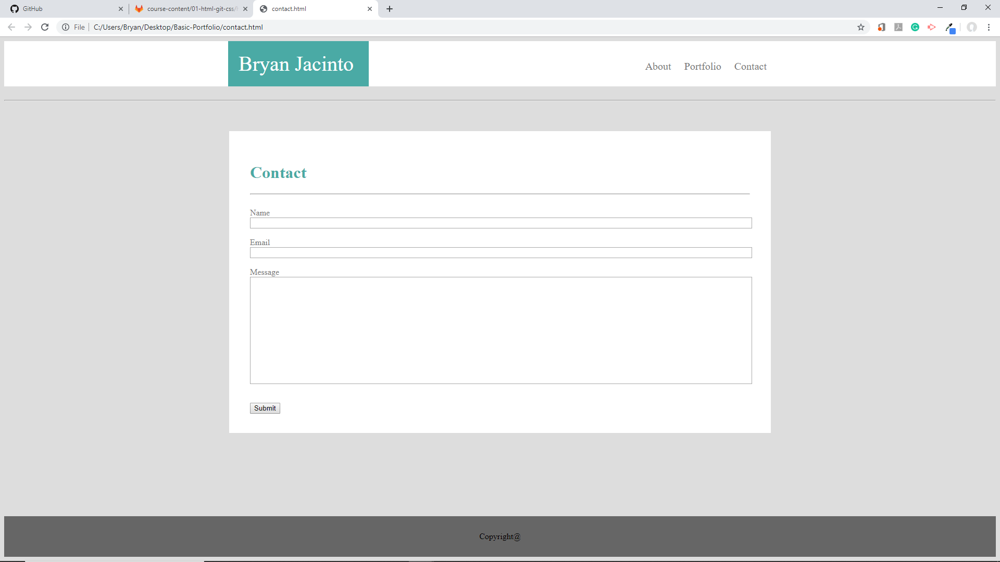
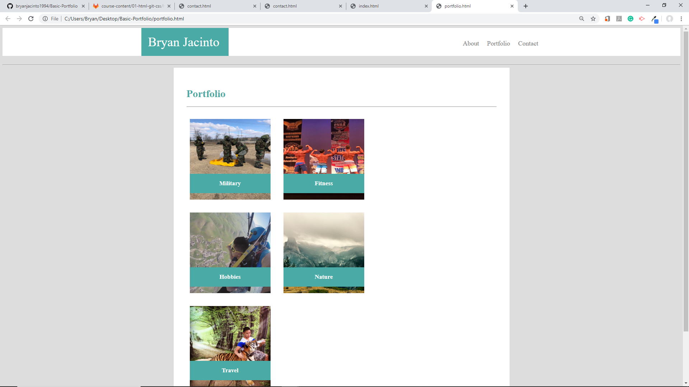
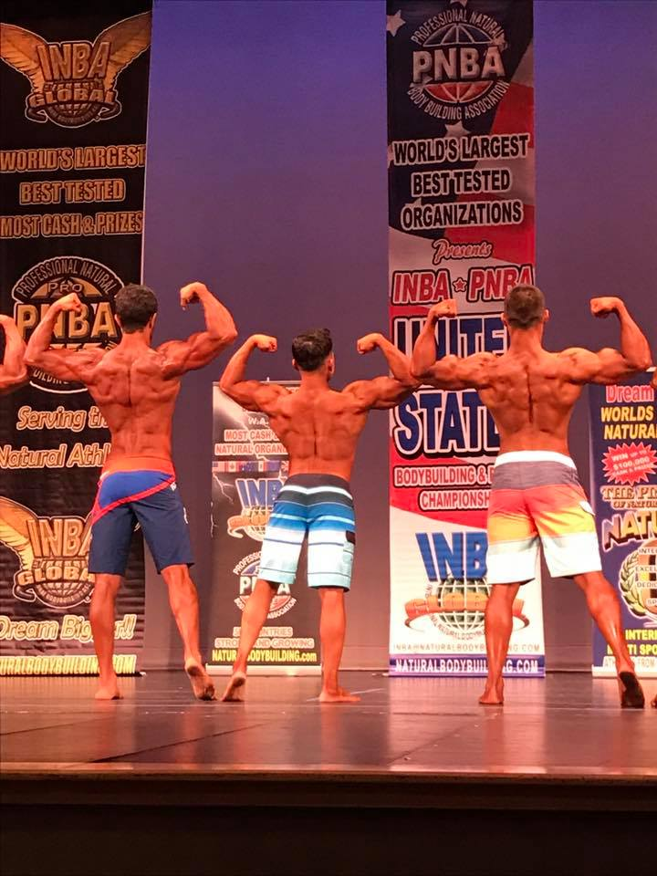

# HW-Wireframe

## Images


<br>

<br>


<hr>

## Tools Used:

* Visual Studio Code - Open source code editor for building and debugging web and cloud applications.
* HTML - Used to create elements on the DOM.
* CSS - Styles the html elements on page. 
* Git - Version control system to track changes to source code.
* Github - Hosts respository that can be deployed to GitHub pages.

<hr>

## Summary

Using Visual Studio Codes, I've created three different html files : About me, Portfolio, and Contact by also using the same stylesheet css for all three of them. The most challenging part of this was trying to get the boxes to align in the position I want them to be in. By doing so, I have made different div classes for each containers and sub-containers and via css to position those containers to "relative" so they can be where I want them to be.

The "About Me" section includes my profile picture to represent myself and a summary explaining what I proudly do in life. 

The "Contact" section includes: Name, Email, and Message; along with text boxes by using the forms commands to allow users to type in their information.

The "Portfolio" includes different pictures that represents me, myself, and I for viewers to see my journey through my photos.

<hr>

## Code Snippet

About me:
```html

 <div class="Navigation">
        <div class="container">
            <div class="Name">
                <h1>Bryan Jacinto</h1>
            </div>
            <nav>

                <a style="color: #777777" href="index.html">About</a>
                &nbsp;&nbsp;&nbsp;
                <a style="color: #777777" href="portfolio.html">Portfolio</a>
                &nbsp;&nbsp;&nbsp;
                <a style="color: #777777" href="contact.html">Contact</a>

            </nav>
        </div>
    </div>
<
    <div class="container" style="margin-top: 120px; padding: 10px;">

        <h1 id="about">About Me</h1>

        <hr>
        <br>

        

        <p>
            Hey this is Bryan! I have been working as a personal trainer for four years and have served in the
            United
            States
            Army. Over the past years, I have also been studying to be a Nurse but I realized that Nursing is not my
            passion. Waking up one day finally realizing that I do not want to wake up every morning going to a
            Nursing
            job
            being unhappy. Finally, I stood my ground and made a huge change in my education and career. I finally
            realized
            that I am more happy in being in the Tech field rather than in the medical field. For some reason,
            everything
            there is to do with technologies, goes straight to my head. Think of it sort of like as a "photographic
            memory"
            where I memorized stuff easily when it comes to numbers and codes. I may not look the part but thats
            when I
            knew
            what career path is rightfor me. Please browse through my "Portfolio" and take a look at my journey.
            Feel
            free
            to contact me as well on the "contact" tab located in the top right corner if you have any other
            questions.
            Have
            a great day!
            Lorem ipsum dolor sit amet, consectetur adipiscing elit. Sed a arcu urna. Sed in leo lacinia elit
            euismod ultricies at et eros. Interdum et malesuada fames ac ante ipsum primis in faucibus. Vestibulum
            vitae facilisis risus. Class aptent taciti sociosqu ad litora torquent per conubia nostra, per inceptos
            himenaeos. Fusce finibus accumsan massa, rhoncus pellentesque lectus dapibus sed. Vestibulum dictum,
            ligula quis suscipit facilisis, sapien ligula molestie dui, quis consequat ligula nibh in urna. Aenean
            quis consequat enim. Quisque in risus quis eros condimentum tincidunt quis nec orci. Etiam finibus et
            metus non semper. Nulla tempus enim sit amet est sodales, sit amet egestas magna cursus. Nunc urna ex,
            viverra ut ipsum ac, iaculis tincidunt enim. Lorem ipsum dolor sit amet, consectetur adipiscing elit.
            Curabitur fermentum mi eu aliquam facilisis. Donec pharetra, lectus vel consequat scelerisque, massa
            nisl tristique elit, id iaculis ante tellus quis nisl. Vivamus ornare massa ipsum.
        </p>
    </div>


<div class="wrapper">
    <div class="push"></div>   
    </div>
<footer class="footer">
    Copyright@
</footer>
```
Contact:
```html
  <div class="Navigation">
        <div class="container">
            <div class="Name">
                <h1>Bryan Jacinto</h1>
            </div>
            <nav>

                <a style="color: #777777" href="index.html">About</a>
                &nbsp;&nbsp;&nbsp;
                <a style="color: #777777" href="portfolio.html">Portfolio</a>
                &nbsp;&nbsp;&nbsp;
                <a style="color: #777777" href="contact.html">Contact</a>

            </nav>
        </div>
    </div>
<
    <div class="container" style="margin-top: 120px; padding: 10px;">

        
        

        <div class="wrapper" style="height: 600px;">

            <h1 id="about">Contact</h1>

            <hr>
            <br>

           <form action="/action_page.php"> 
           
            Name<br>
            <input type="text" id="Name" name="Name">
            <br>
            <br>
            Email<br> 
            <input type="text" id="Email" name="Email">
            <br>
            <br>
            Message<br>
            <input type="text" id="Message" name="Message">
            <br><br><br>
            <input type="Submit" id="Sumbit" value="Submit">
            </form>
        </div>
    </div>


<div class="wrapper">
    <div class="push"></div>   
    </div>
<footer class="footer">
    Copyright@
</footer>
```
Portfolio:
```html
<div class="Navigation">
        <div class="container">
            <div class="Name">
                <h1>Bryan Jacinto</h1>
            </div>
            <nav>

                <a style="color: #777777" href="index.html">About</a>
                &nbsp;&nbsp;&nbsp;
                <a style="color: #777777" href="portfolio.html">Portfolio</a>
                &nbsp;&nbsp;&nbsp;
                <a style="color: #777777" href="contact.html">Contact</a>

            </nav>
        </div>
    </div>
    < <div class="container" style="margin-top: 120px; padding: 10px; height: 1050px;">

        <h1 id="about">Portfolio</h1>

        <hr>
        <br>

        <div class="picture1">
            
            <div class="text-1">
                <h3>Military</h3>
            </div>

        </div>

        <div class="picture2">
            
            <div class="text-2">
                <h3>Fitness</h3>
            </div>
        </div>
    

    <div class="picture3">
        
        <div class="text-3">
            <h3>Hobbies</h3>
        </div>
    </div>

    <div class="picture4">
        

        <div class="text-4">
            <h3>Nature</h3>
        </div>
    </div>

    <div class="picture5">
        
        <div class="text-5">
            <h3>Travel</h3>
        </div>
    </div>
            
        </div>


        <div class="wrapper">
            <div class="push"></div>
        </div>
        <footer class="footer">
            Copyright@
        </footer>
```
## Author Links
Linkedin: https://www.linkedin.com/in/bryan-jacinto-100438aa/

Github:
https://github.com/bryanjacinto1994


 
