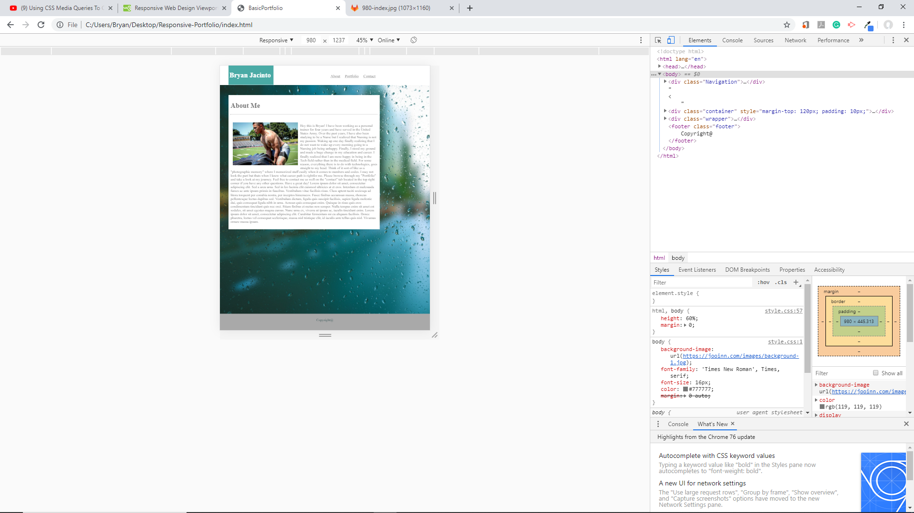
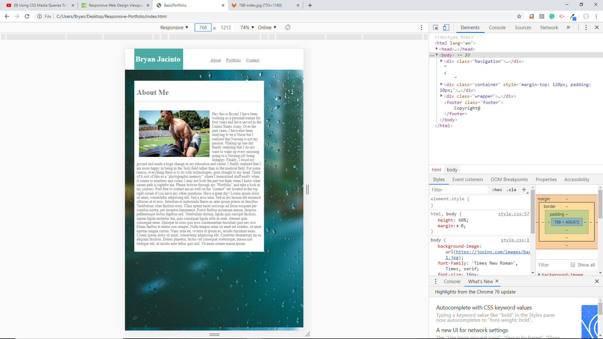
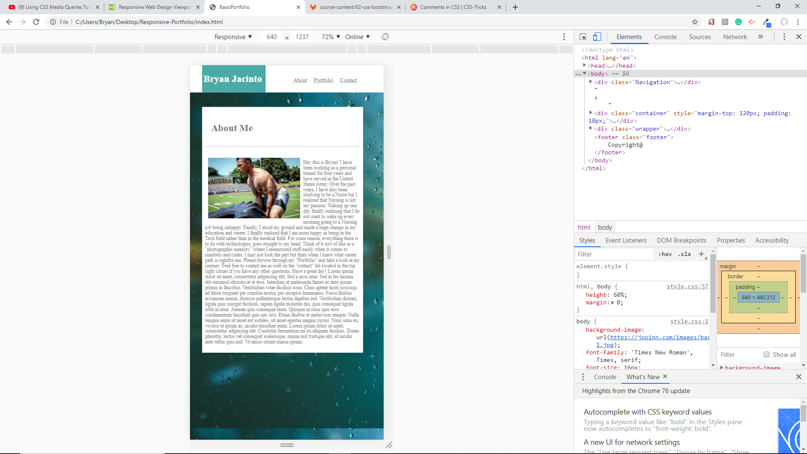

# Responsive-Portfolio

## Images
980px : 

<br>
768px:

<br>
640px:


<hr>

## Tools Used:

* Visual Studio Code - Open source code editor for building and debugging web and cloud applications.
* HTML - Used to create elements on the DOM.
* CSS - Styles the html elements on page. 
* Git - Version control system to track changes to source code.
* Github - Hosts respository that can be deployed to GitHub pages.

<hr>

## Summary

Using CSS via Visual Studio Codes, I was able to use media queries to appoint the exact dimensions I want them to for my About Me section. This assignment was to have mobile responsiveness for specific pixels : 980px, 768px, and 640px. Making adjustments with media query via css, I was able to fit the About Me page to the desired dimensions fitted for Laptop, Tablets, and mobile devices.

<hr>

## Code Snippet


```html

 body {
    background-image: url(https://jooinn.com/images/background-1.jpg);
    font-family: 'Times New Roman', Times, serif;
    font-size: 16px;
    color: #777777;
    margin: 0 auto;
    
    
}

.Navigation {
    background-color: white;
    width: 960px;
    position: fixed;
    width: 100%;
    margin: 0 auto;


}

.container {
    width: 960px;
    background: white;
    margin: 0 auto;
}


.Name {
    background-color: #4aaaa5;
    color: white;
    width: 200px;
    padding: 5px;
    float: left;
}

nav {
    color: #777777;
    font-size: 18px;
    float: right;
    margin-top: 40px;
}

#image {
    float: left;
    margin: 10px;
    
}

.footer {
    
    background: rgb(169, 169, 169);
    padding: 20px;
    text-align: center;
    color: darkslategray
}

html, body {
    height: 60%;
    margin: 0;
}

.wrapper {
    min-height: 100%;
    margin-bottom: -50px;
}

.footer,
.push {
    height: 50px;
}

#Name,
#id,
#Email,
#Message {
    width: 960px;
}

#Message {
    height: 250px;
}

.text-1 {
    position: relative;
    background-color: #4aaaa5;
    color: white;
    text-align: center;
    width: 250px;
    bottom: 80px;
}

.text-2 {
    position: relative;
    background-color: #4aaaa5;
    color: white;
    text-align: center;
    width: 250px;
    bottom: 80px;
}

.picture3 {
    position: relative;
    left: 350px;
    bottom: 625px;
}

.text-3 {
    position: relative;
    background-color: #4aaaa5;
    color: white;
    text-align: center;
    width: 250px;
    bottom: 80px;
}

.picture4 {
    position: relative;
    left: 350px;
    bottom: 625px;
}

.text-4 {
    position: relative;
    background-color: #4aaaa5;
    color: white;
    text-align: center;
    width: 250px;
    bottom: 80px;
}

.picture5 {
    position: relative;
    bottom: 625px;
}

.text-5 {
    position: relative;
    background-color: #4aaaa5;
    color: white;
    text-align: center;
    width: 250px;
    bottom: 80px;
}

@media screen and (max-width:980px){
.container {
    width: 90%;
    margin-left: 40px;
    }
.wrapper {
    width: 20%;
}
}
/* What left to do is to try to fit the contact and portfolio in place. Also needs to make width form smaller. About me section is working fine*/
@media screen and (max-width: 768){
    .container{
        overflow: auto;

    }
} 
/* What left to do is to try to fit the contact and portfolio in place. Another thing is to try to get the boxes to stack on top of each other in portfolio and the Navigation tab links to be placed under the "Name". About me section is working fine*/

@media screen and (max-width:640px){
    .container {
        width: 80%
    }

    #about {
        padding: 20px;
        float: none;
    }

    
   
}
```
## Author Links
Linkedin: https://www.linkedin.com/in/bryan-jacinto-100438aa/

Github:
https://github.com/bryanjacinto1994


 
